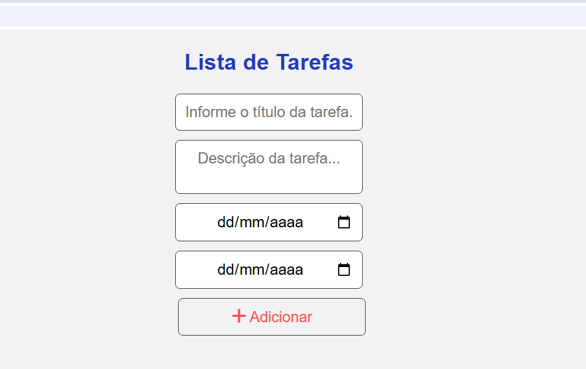
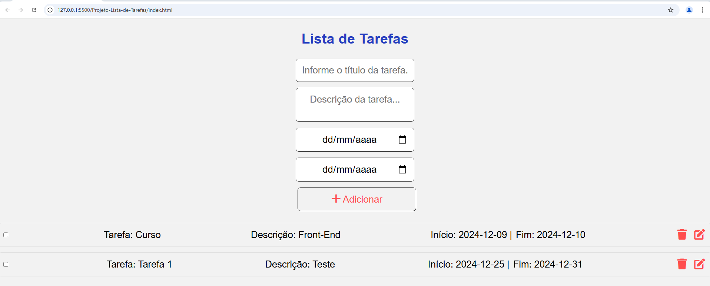
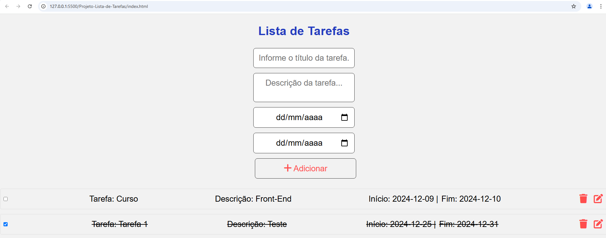

# To-Do List

Este é uma simples lista de tarefas (To-Do List) onde você pode adicionar, editar, remover e marcar tarefas como concluídas. As tarefas são armazenadas no `localStorage`, o que significa que suas tarefas serão persistidas mesmo após o fechamento do navegador.

## Funcionalidades

- **Adicionar tarefas**: Você pode adicionar novas tarefas com título, descrição e datas de início e término.
- **Editar tarefas**: Você pode editar qualquer tarefa, incluindo seu título, descrição e datas.
- **Remover tarefas**: Você pode remover tarefas que não deseja mais.
- **Marcar tarefas como concluídas**: Ao marcar uma tarefa como concluída, o título, descrição e datas da tarefa ficam riscados.
- **Persistência de dados**: As tarefas são salvas no `localStorage`, então, mesmo ao atualizar a página, as tarefas permanecem.

## Tecnologias Utilizadas

- **HTML**: Para a estrutura do conteúdo da página.
- **CSS**: Para estilização do layout.
- **JavaScript**: Para manipulação de tarefas, interações com o usuário e armazenamento no `localStorage`.

## Instruções de Uso

1. **Clone o repositório**:
   ```bash
   git clone https://github.com/ltsilva23/Todo-List.git

2. **Abra o arquivo index.html no seu navegador**: 
   
   Basta abrir o arquivo index.html diretamente no seu navegador. Não é necessário configurar um servidor para rodar o aplicativo, pois ele é baseado apenas em HTML, CSS e JavaScript.

3. **Use a aplicação**:

- Adicione novas tarefas no formulário, fornecendo o título, descrição e datas de início e término.
- Você pode editar ou remover qualquer tarefa clicando nos botões apropriados.
- Ao marcar uma tarefa como concluída, o título, descrição e datas da tarefa ficam riscados.
- As tarefas são armazenadas no localStorage e, portanto, permanecem após atualizar a página ou fechar o navegador.

# Tela Inicial

Aqui está uma captura da tela inicial do aplicativo To-Do List, onde você pode adicionar, editar e gerenciar suas tarefas:



## Com as Tarefas

Após adicionar algumas tarefas, a lista aparece desta forma. As tarefas podem ser marcadas como concluídas, editadas ou removidas:





## Como Contribuir

1. Faça um fork deste repositório.
2. Crie uma nova branch (git checkout -b minha-branch).
3. Faça suas modificações.
4. Commit suas alterações (git commit -am 'Adiciona nova funcionalidade').
5. Envie para o repositório (git push origin minha-branch).
6. Abra um pull request.
